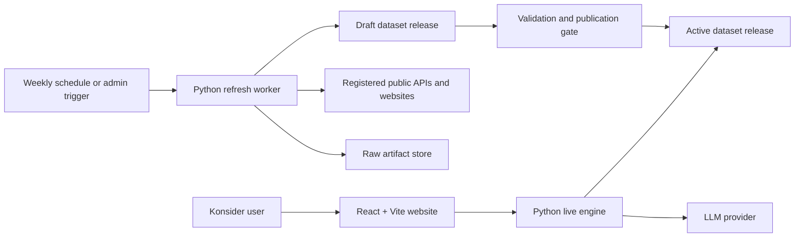
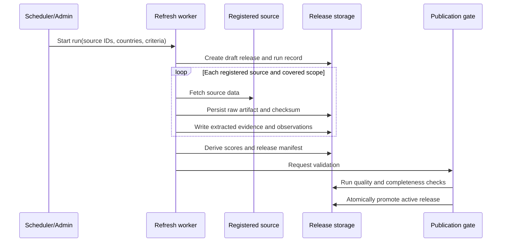
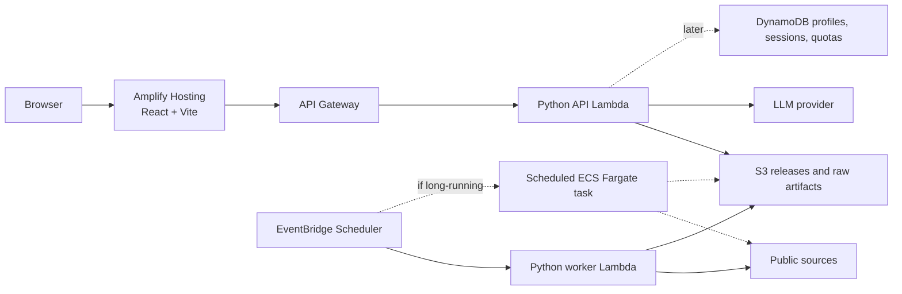

# Konsider Architecture

Status: deferred target architecture; worker stabilization is the only active implementation scope

Last updated: 2026-07-18

The live engine, FastAPI, React, retrieval, chat, agents, MCP, and cloud deployment described below
are design records only. The five-criterion dataset gate is not green. No product-stack
implementation may begin until the roadmap's licensing, methodology, and readiness blockers close.

## Purpose

Konsider is an evidence-backed country suitability and relocation advisor. It combines
periodically refreshed country evidence, deterministic personalized scoring, and conversational
exploration. The product must explain not only which countries rank highly, but which priorities,
source observations, transformations, caveats, and evidence references produced each result.

This document defines the intended module boundaries and handshakes. The current repository
implements the fixture repository and deterministic scoring domain; API, worker, web, retrieval,
and LLM integrations are added incrementally according to [roadmap.md](roadmap.md).

## Architectural Principles

1. **One scoring authority.** Ranking, score contribution, and weight normalization run in the
   Python live engine. The web application never reimplements business logic.
2. **Evidence before explanation.** LLM output may interpret intent and explain retrieved facts,
   but it may not invent metrics, sources, or ranking calculations.
3. **Immutable dataset releases.** A refresh job prepares and validates a complete release before
   atomically promoting it. Live requests never observe a partially refreshed dataset.
4. **Release artifacts first.** At the expected Phase 1 scale, a versioned release directory in the
   local filesystem or S3 is simpler than a database-backed analytical model. Databases are added
   only for mutable user state, operational tracking, or scale pressure.
5. **Canonical long-form metrics.** Country-by-criteria tables are read models for UI display. The
   canonical metric shape is one record per country, criterion, release, method, source lineage,
   raw value, normalized score, confidence, and evidence reference set.
6. **Reproducible answers.** Every ranking and explanation identifies its dataset version,
   scoring-method version, normalized weights, and evidence references.
7. **Explicit boundaries.** The worker writes releases, the live engine serves decisions, and the
   website communicates only with the live engine API.
8. **Local-first, AWS-ready.** The same services run locally against files and in AWS against S3 or
   other managed storage through repository adapters.

## System Context



The website calls only the live engine. The live engine calls storage and the LLM provider. The
worker calls public sources and storage. The browser never receives storage credentials, source
credentials, or LLM credentials.

## Deployable Components

| Component | Owns | Does not own | Local target | Initial AWS target |
| --- | --- | --- | --- | --- |
| Data refresh worker | Source connectors, raw capture, extraction, normalization, validation, release publication | User requests, ranking, chat | `python -m konsider_worker refresh` writing to a local release directory | EventBridge Scheduler -> Python Lambda writing S3 releases; move to scheduled ECS Fargate only if a run exceeds Lambda limits or needs browser automation |
| Live engine | Profiles, deterministic ranking, evidence retrieval, chat orchestration, public API | Source scraping, UI rendering, direct browser state | FastAPI/Uvicorn reading the local active release | API Gateway -> Python Lambda reading S3 releases; consider App Runner/ECS only if Lambda constraints become real |
| Web application | User interaction, editable weights, ranking table, evidence views, chat UI | Scoring logic, source access, LLM credentials, storage access | React + Vite dev server calling localhost API | Amplify Hosting for the static SPA |
| Storage | Raw artifacts, release manifests, catalog, metrics, evidence, optional profile/chat state | Business workflows | Files under `data/` or `.konsider/releases` | S3 for releases and raw artifacts; DynamoDB later for profiles, sessions, quotas, and usage; vector/SQL stores only when needed |

Detailed component designs:

- [Data refresh worker](components/data-refresh-worker.md)
- [Live Python engine](components/live-engine.md)
- [React website](components/web-application.md)
- [Storage architecture](storage.md)

## Runtime Boundaries

### Worker to Storage

The worker writes only to a new draft dataset release. Publication is an explicit operation after
schema, range, freshness, provenance, completeness, and regression checks pass. Promotion changes
the active-release pointer atomically; previous releases remain readable for audit and rollback.

The worker distinguishes four data levels:

| Level | Meaning | Example store |
| --- | --- | --- |
| Raw artifact | Original source response or file exactly as fetched, plus checksum and retrieval metadata | Local files or S3 |
| Extracted evidence | Clean source-backed text snippets or document sections tagged by country and criterion | `evidence.jsonl` |
| Metric observation | Exact observed value, unit, geography, effective period, and source lineage | `observations.jsonl` |
| Metric score | Normalized 1-10 score, confidence, methodology version, and evidence references | `metrics.jsonl` |

Source registrations define the expected coverage. A source may cover all countries, a subset of
countries, one criterion, or several criteria. Each attempted country/source/criterion combination
records a status such as `success`, `no_data`, `failed`, or `rejected`; missing required coverage
blocks publication.

The live engine never calls external evidence sources during a user request. This keeps latency,
availability, cost, and answers predictable.

### Website to Live Engine

The website uses versioned HTTPS endpoints under `/api/v1`. It sends user intent and presentation
choices, not formulas. The API returns display-ready identifiers, normalized weights, score
contributions, evidence references, caveats, and version metadata.

The first chat implementation should use HTTP plus Server-Sent Events (SSE) for token and typed
event streaming. WebSockets remain an option only if the product needs independent server push or
richer bidirectional behavior.

### Live Engine to LLM

LLM credentials and prompts remain server-side. The chat orchestrator exposes deterministic tools
for ranking, profile mutation, evidence search, comparison, and critique. Tool results are the
source of numerical and factual claims in generated responses.

Chat output has two channels:

- Human-readable text for explanation.
- Typed events for state changes such as weight proposals, applied profile revisions, ranking
  results, citations, errors, and completion.

## Core Data Model

The target logical model extends the current Phase 1 fixtures.

| Entity | Purpose |
| --- | --- |
| `Country` | Stable country identity and display metadata |
| `Criterion` | Suitability dimension, label, direction, unit expectations, and scoring policy |
| `SourceRegistration` | Approved source, access method, terms, schedule, parser, coverage, and owner |
| `RefreshRun` | One scheduled or manual attempt, with scope, status, counts, and errors |
| `RawArtifact` | Original source body or file with provenance, retrieval metadata, and checksum |
| `EvidenceItem` | Source-backed text or artifact excerpt with country/criterion associations |
| `MetricObservation` | Raw value captured from a source for a country, criterion, and effective period |
| `MetricScore` | Normalized 1-10 value derived from one or more observations |
| `DatasetRelease` | Immutable, validated collection of catalog, evidence, observations, and scores |
| `ProfileTemplate` | Server-owned named weight set such as `finance_professional` |
| `UserProfileDraft` | Temporary browser/session-specific edited weight set |
| `SavedProfile` | Persisted custom weights, introduced when user accounts exist |
| `RankingResult` | Ranked countries and criterion contributions for one profile and release |
| `Conversation` | Chat messages, tool activity, citations, and profile revisions |

The Phase 1 table view can still display countries as rows and criteria as columns. That view is
derived from `MetricScore` records, not used as the canonical storage contract.

## Profiles

Profiles are named weight sets, not independent scoring formulas.

| Profile type | Initial owner | Persistence |
| --- | --- | --- |
| Template profile | Live engine catalog | Versioned in code or release config |
| Edited template | Browser until submitted to ranking API | React state and optional local storage |
| Chat-modified profile | Live engine conversation state | In memory first; DynamoDB later if sessions persist |
| Saved custom profile | Live engine user account | Deferred until authentication exists |

Chat may translate preferences into a structured weight patch, but the backend validates,
normalizes, applies, and reranks. The UI updates sliders and ranking tables only from structured
events returned by the engine.

## Public API Contract

FastAPI will be the contract authority and will generate OpenAPI. Generated frontend types should
be produced from that document rather than maintained independently.

Initial endpoints:

| Method and path | Purpose |
| --- | --- |
| `GET /api/v1/health` | Liveness and active-release readiness |
| `GET /api/v1/catalog` | Countries, criteria, profile templates, active release metadata, and caveats |
| `GET /api/v1/countries` | Country list when the client needs a smaller catalog response |
| `GET /api/v1/criteria` | Criterion list when the client needs a smaller catalog response |
| `GET /api/v1/countries/{country_id}/metrics` | Full score and observation view for one country |
| `GET /api/v1/evidence?country_id=...&criterion_id=...` | Evidence lookup filtered by country, criterion, source, or topic |
| `POST /api/v1/rankings` | Normalize weights and return a ranked top-K result |
| `POST /api/v1/chat/sessions` | Create a conversation and associated profile state |
| `POST /api/v1/chat/sessions/{session_id}/messages` | Send a message and stream text plus typed events |

Example ranking request:

```json
{
  "profile_id": "finance_professional",
  "weights": {
    "finance_jobs": 5,
    "tax_burden": 4,
    "infrastructure": 3
  },
  "top_k": 5
}
```

Example response shape:

```json
{
  "request_id": "req_123",
  "dataset_version": "2026-07-18.2",
  "scoring_version": "weighted-score-v1",
  "normalized_weights": {
    "finance_jobs": 0.4167,
    "tax_burden": 0.3333,
    "infrastructure": 0.25
  },
  "rankings": [
    {
      "rank": 1,
      "country_id": "singapore",
      "total_score": 8.42,
      "contributions": [],
      "evidence_refs": []
    }
  ],
  "caveats": ["WHO UHC is population service coverage, not migrant access experience."]
}
```

All error responses use a stable error code, human-readable message, request ID, and optional field
details. Clients must not parse message text to determine behavior.

## Primary Flows

### Dataset Refresh



### Personalized Ranking

1. The website loads the catalog and active dataset metadata.
2. The user selects a template profile and edits weights.
3. The website posts weights and `top_k` to the ranking endpoint.
4. The engine validates and normalizes weights, loads one published release, and calls the pure
   scoring domain.
5. The response includes contributions, versions, evidence references, and caveats.

### Evidence and Explanation

Konsider has three different explanation modes:

- **Structured lookup:** actual score, raw value, confidence, and methodology for a country and
  criterion.
- **Deterministic ranking explanation:** why one country ranks above another, based on normalized
  weights and contribution differences.
- **Evidence retrieval/RAG:** source-backed text used to explain or qualify a metric.

The final answer to a user may combine all three, but the engine keeps the computations and
retrieved evidence explicit.

### Conversational Refinement

1. The website sends a message with the current profile revision.
2. The engine extracts intent and invokes registered tools when data or state is needed.
3. A weight change produces a typed `profile.proposed` or `profile.updated` event, never only prose.
4. The engine recalculates rankings through the same ranking service used by the REST endpoint.
5. Explanations cite evidence IDs and include the dataset version.
6. The website updates controls from structured events and offers undo or confirmation where
   appropriate.

## AWS Deployment Path

The initial production architecture should match the expected scale: weekly refreshes, fewer than
1,000 non-LLM API calls per day, and roughly 100 LLM chat calls per day.



Recommended sequence:

1. Local files, local FastAPI, and local Vite for the Phase 1/2 implementation.
2. Amplify Hosting for the static React app.
3. API Gateway plus Python Lambda for catalog, ranking, evidence, and initial chat endpoints.
4. EventBridge Scheduler plus Python Lambda for weekly/manual refresh jobs.
5. S3 as the first production release and raw artifact store.
6. DynamoDB only when profiles, conversations, payment gating, quotas, or chat usage need durable
   mutable storage.
7. Scheduled ECS Fargate only if worker execution exceeds Lambda limits or requires heavier
   browser/document processing.
8. App Runner/ECS for the live API only if measured cold starts, streaming behavior, dependency
   size, or operational needs make Lambda uncomfortable.

## Local End-to-End Flow

Local development should not require cloud credentials.

```text
local worker -> local release directory
local FastAPI -> local release directory
React/Vite -> http://localhost:8000
LLM calls -> stub by default, optional real provider key
```

The production adapters replace local release storage with S3 and optional mutable state stores.
The domain, scoring, API contracts, and UI behavior stay the same.

## Security and Operations

- Authentication can be introduced with Amazon Cognito without changing API ownership.
- LLM and source credentials are stored in AWS Secrets Manager and never sent to the browser.
- Source connectors use least-privilege credentials and honor source terms, licenses, and robots
  policies. Public APIs are preferred to scraping.
- Raw evidence is treated as untrusted input. Parsing and prompt contexts require size limits,
  content validation, and prompt-injection defenses.
- Logs use request, refresh-run, dataset-release, conversation, and profile-revision identifiers.
- Metrics cover API latency/error rate, source failures, release freshness, validation failures,
  LLM cost/latency, retrieval quality, and ranking distribution changes.
- Dataset publication and scoring changes create an audit record. Rollback means repointing the
  active release, not rewriting history.

## Architecture Decisions Deferred

The following choices should be made from measured requirements rather than fixed during the MVP:

- Whether the live API remains Lambda-based or moves to App Runner/ECS.
- Whether individual worker connectors remain Lambda-based or move to scheduled ECS Fargate.
- Whether profile/session state needs DynamoDB before user accounts are introduced.
- Whether evidence retrieval needs embeddings and a vector index, or metadata filtering remains
  enough.
- Whether SQL is needed for operational records once releases and user state grow.
- Cognito and anonymous-session policy.
- SSE versus WebSockets beyond the first chat implementation.

## AWS References

The AWS deployment path above relies on current AWS service capabilities documented here:

- [Amplify Hosting monorepo configuration](https://docs.aws.amazon.com/amplify/latest/userguide/monorepo-configuration.html)
- [Lambda timeout configuration](https://docs.aws.amazon.com/lambda/latest/dg/configuration-timeout.html)
- [API Gateway response streaming](https://docs.aws.amazon.com/apigateway/latest/developerguide/response-transfer-mode.html)
- [EventBridge Scheduler for ECS tasks](https://docs.aws.amazon.com/AmazonECS/latest/developerguide/tasks-scheduled-eventbridge-scheduler.html)
