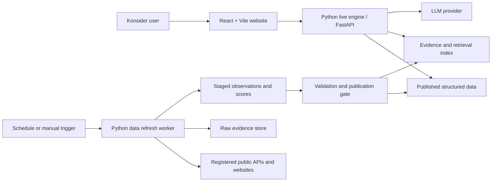
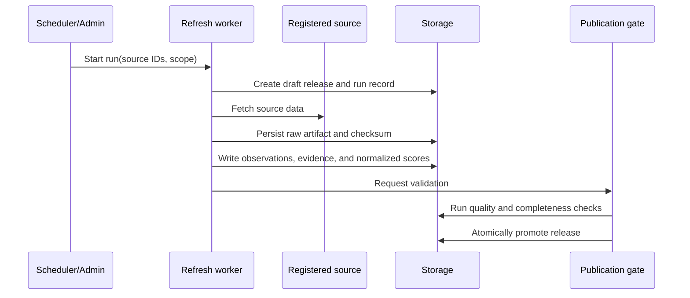

# Konsider Architecture

Status: accepted target architecture

Last updated: 2026-07-17

## Purpose

Konsider is an evidence-backed country suitability and relocation advisor. It combines
periodically refreshed country evidence, deterministic personalized scoring, and conversational
explanations. The product must explain not only which countries rank highly, but which user
priorities, source observations, transformations, and caveats produced each result.

This document defines the target boundaries and contracts. The current repository implements
only the fixture repository and deterministic scoring domain; the remaining components are added
incrementally according to [roadmap.md](roadmap.md).

## Architectural Principles

1. **One scoring authority.** Ranking and weight normalization run in the Python live engine.
   The web application never reimplements business logic.
2. **Evidence before explanation.** LLM output may interpret intent and explain retrieved facts,
   but it may not invent metrics, sources, or ranking calculations.
3. **Immutable dataset releases.** A refresh job prepares and validates a complete release before
   atomically promoting it. Live requests never observe a partially refreshed dataset.
4. **Reproducible answers.** Every ranking and explanation identifies its dataset version,
   scoring-method version, normalized weights, and evidence references.
5. **Explicit boundaries.** The worker writes releases, the live engine serves decisions, and the
   website communicates only with the live engine API.
6. **Local-first, AWS-ready.** Repository interfaces allow fixtures to be replaced by AWS storage
   without changing domain scoring behavior.
7. **Provenance is product data.** Source, retrieval time, effective date, transformation,
   confidence, licensing notes, and checksums are retained with observations and evidence.

## System Context



## Deployable Components

| Component | Owns | Does not own | Initial AWS target |
| --- | --- | --- | --- |
| Data refresh worker | Source connectors, raw capture, normalization, validation, release publication | User requests, ranking, chat | EventBridge Scheduler and Step Functions; Lambda or ECS Fargate tasks |
| Live engine | Profiles, deterministic ranking, evidence retrieval, chat orchestration, public API | Source scraping, UI rendering | FastAPI container on App Runner or ECS Fargate |
| Web application | User interaction, profile editing, ranking presentation, evidence views, chat UI | Scoring logic, source access, LLM credentials | React + Vite on Amplify Hosting |
| Storage | Raw artifacts, observations, scores, releases, evidence, profiles, conversations | Business workflows | S3 plus PostgreSQL/Aurora; vector index added when retrieval requires it |

Detailed component designs:

- [Data refresh worker](components/data-refresh-worker.md)
- [Live Python engine](components/live-engine.md)
- [React website](components/web-application.md)
- [Storage architecture](storage.md)

## Runtime Boundaries

### Worker to Storage

The worker writes only to a new `draft` dataset release. Publication is an explicit operation
after completeness, schema, range, freshness, provenance, and regression checks pass. Promotion
changes the active release pointer atomically; previous releases remain readable for audit and
rollback.

The live engine never calls external evidence sources during a user request. This keeps latency,
availability, cost, and answers predictable.

### Website to Live Engine

The website uses versioned HTTPS endpoints under `/api/v1`. It sends user intent and presentation
choices, not formulas. The API returns display-ready identifiers, normalized weights, score
contributions, evidence references, caveats, and version metadata.

The first chat implementation should use HTTP plus Server-Sent Events (SSE) for token and
structured-event streaming. WebSockets remain an option when the product needs independent server
push or richer bidirectional behavior.

### Live Engine to LLM

LLM credentials and prompts remain server-side. The chat orchestrator exposes deterministic tools
for ranking, profile mutation, evidence search, comparison, and critique. Tool results are the
source of numerical and factual claims in generated responses.

Chat output has two channels:

- Human-readable text for explanation.
- Typed events for state changes such as weight proposals, applied profile revisions, ranking
  results, citations, errors, and completion.

## Core Data Model

The target logical model extends the current Phase 1 fixtures.

| Entity | Purpose |
| --- | --- |
| `Country` | Stable country identity and display metadata |
| `MetricDefinition` | Meaning, unit, direction, normalization policy, and scoring-method version |
| `SourceRegistration` | Approved source, access method, terms, schedule, parser, and ownership |
| `EvidenceItem` | Source-backed text or artifact with provenance and country/metric associations |
| `MetricObservation` | Raw value captured from a source for a country, metric, and effective period |
| `MetricScore` | Normalized 1-10 value derived from one or more observations |
| `DatasetRelease` | Immutable, validated collection of definitions, evidence, observations, and scores |
| `UserProfile` | User context and current parameter weights with a revision number |
| `RankingResult` | Ranked countries and parameter contributions for one profile and release |
| `Conversation` | Chat messages, tool activity, citations, and profile revisions |

## Public API Contract

FastAPI will be the contract authority and will generate OpenAPI. Generated frontend types should
be produced from that document rather than maintained independently.

Initial endpoints:

| Method and path | Purpose |
| --- | --- |
| `GET /api/v1/health` | Liveness and release readiness |
| `GET /api/v1/catalog` | Countries, metric definitions, profile templates, active release metadata |
| `POST /api/v1/rankings` | Normalize weights and return a ranked top-K result |
| `GET /api/v1/countries/{country_id}/evidence` | Retrieve evidence filtered by metric or topic |
| `POST /api/v1/chat/sessions` | Create a conversation and associated profile state |
| `POST /api/v1/chat/sessions/{session_id}/messages` | Send a message and stream text plus typed events |

Example ranking request:

```json
{
  "profile_id": "finance_professional",
  "weights": {
    "finance_jobs": 5,
    "tax_burden": 4,
    "infrastructure": 3
  },
  "top_k": 5
}
```

Example response shape:

```json
{
  "request_id": "req_123",
  "dataset_version": "2026-07-17.1",
  "scoring_version": "weighted-score-v1",
  "normalized_weights": {
    "finance_jobs": 0.4167,
    "tax_burden": 0.3333,
    "infrastructure": 0.25
  },
  "rankings": [
    {
      "rank": 1,
      "country_id": "singapore",
      "total_score": 8.42,
      "contributions": [],
      "evidence_refs": []
    }
  ],
  "caveats": ["Phase 1 values are approximate MVP estimates."]
}
```

All error responses use a stable error code, human-readable message, request ID, and optional field
details. Clients must not parse message text to determine behavior.

## Primary Flows

### Dataset Refresh



### Personalized Ranking

1. The website loads the catalog and active dataset metadata.
2. The user selects a profile and edits weights.
3. The website posts weights and `top_k` to the ranking endpoint.
4. The engine validates and normalizes weights, loads one published release, and calls the pure
   scoring domain.
5. The response includes contributions, versions, evidence references, and caveats.

### Conversational Refinement

1. The website sends a message with the current profile revision.
2. The engine extracts intent and invokes registered tools when data or state is needed.
3. A weight change produces a typed `profile.proposed` or `profile.updated` event, never only prose.
4. The engine recalculates rankings through the same ranking service used by the REST endpoint.
5. Explanations cite evidence IDs and include the dataset version.
6. The website updates controls from structured events and offers undo or confirmation where
   appropriate.

## Security and Operations

- Authentication can be introduced with Amazon Cognito without changing API ownership.
- LLM and source credentials are stored in AWS Secrets Manager and never sent to the browser.
- Source connectors use least-privilege credentials and honor source terms, licenses, and robots
  policies. Public APIs are preferred to scraping.
- Raw evidence is treated as untrusted input. Parsing and prompt contexts require size limits,
  content validation, and prompt-injection defenses.
- Logs use request, refresh-run, dataset-release, conversation, and profile-revision identifiers.
- Metrics cover API latency/error rate, source failures, release freshness, validation failures,
  LLM cost/latency, retrieval quality, and ranking distribution changes.
- Dataset publication and scoring changes create an audit record. Rollback means repointing the
  active release, not rewriting history.

## Architecture Decisions Deferred

The following choices should be made from measured requirements rather than fixed during the MVP:

- App Runner versus ECS Fargate for the live API.
- Lambda versus Fargate tasks per worker connector.
- Aurora PostgreSQL versus DynamoDB for operational records.
- PostgreSQL vector extension versus OpenSearch for evidence retrieval.
- Cognito and anonymous-session policy.
- SSE versus WebSockets beyond the first chat implementation.
