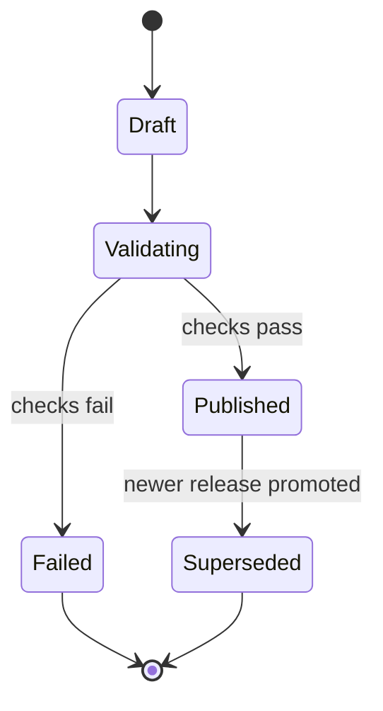

# Storage Architecture

## Goals

Storage must make every recommendation reproducible, preserve original evidence, support atomic
dataset publication, and allow local fixture adapters to evolve into AWS-backed repositories. The
logical model is more important than committing prematurely to one database product.

## Data Classes

| Class | Examples | Mutability | Suggested production store |
| --- | --- | --- | --- |
| Raw source artifacts | API JSON, CSV, HTML, PDFs, headers, checksums | Immutable | S3 |
| Source registry | Connector configuration, license notes, schedule | Versioned | PostgreSQL/Aurora |
| Refresh operations | Runs, attempts, errors, validation reports | Append/update status | PostgreSQL/Aurora |
| Published country data | Observations, normalized scores, release manifests | Immutable by release | PostgreSQL/Aurora |
| Qualitative evidence | Extracted text, metadata, source linkage | Immutable by release | S3 plus PostgreSQL metadata |
| Retrieval index | Evidence chunks and embeddings | Rebuildable by release | PostgreSQL vector extension or OpenSearch |
| User state | Profiles, weights, revisions | Mutable with history | PostgreSQL/Aurora |
| Conversation state | Messages, tool events, citations | Append-oriented | PostgreSQL/Aurora; archive to S3 if needed |

## Dataset Release Model

A refresh creates a new release in `draft`. Observations, scores, evidence, validation results, and
a manifest all reference the release ID. Publication moves it to `published` and atomically updates
one active-release pointer.



Published records are not edited. Corrections produce a new release. Rollback changes the active
pointer to an earlier compatible release and records who performed the operation and why.

Minimum release metadata:

```json
{
  "release_id": "rel_2026_07_17_01",
  "dataset_version": "2026-07-17.1",
  "schema_version": "1",
  "scoring_method_versions": ["weighted-score-v1", "healthcare-normalization-v1"],
  "status": "published",
  "created_at": "2026-07-17T08:00:00Z",
  "published_at": "2026-07-17T10:00:00Z",
  "manifest_checksum": "sha256:..."
}
```

## Provenance Chain

Every `MetricScore` links to its `MetricObservation` inputs. Every observation and evidence item
links to a `RawArtifact` and `SourceRegistration`. Required provenance includes:

- Canonical source ID and public URL when redistribution permits it.
- Retrieval timestamp and source effective period.
- HTTP or file metadata and content checksum.
- Connector, parser, normalization, and scoring-method versions.
- Geographic scope, unit, and transformation notes.
- Confidence, quality flags, and human overrides with actor and reason.

This chain allows the engine to answer "why does this score exist?" without relying on generated
text.

## Logical Repository Interfaces

Python services depend on narrow interfaces rather than database clients:

- `ReleaseRepository`: active release, release by version, publish/rollback operations.
- `CatalogRepository`: countries and metric definitions for a release.
- `MetricsRepository`: country/metric scores and observation lineage.
- `EvidenceRepository`: filtered evidence lookup and later semantic search.
- `ProfileRepository`: revision-controlled user weights and templates.
- `ConversationRepository`: messages, typed events, tool calls, and citations.

The current `FixtureProjectDataRepository` loads the Phase 1 files from `data/fixtures` and is the
first adapter for catalog, metrics, and evidence reads.

## Local and AWS Mapping

| Concern | Local Phase 1 | Production direction |
| --- | --- | --- |
| Published metrics/catalog | JSON-compatible YAML and CSV fixtures | PostgreSQL/Aurora release tables |
| Evidence bodies | Markdown fixtures | S3 objects plus metadata rows |
| Vector retrieval | None initially | PostgreSQL vector extension or OpenSearch |
| Profiles/conversations | In-memory initially | PostgreSQL/Aurora |
| Raw artifacts | Source fixtures later | Versioned and encrypted S3 bucket |
| Active release | Fixture directory/config | Transactional database pointer |

## Security, Retention, and Recovery

- Encrypt S3 and databases at rest and require TLS in transit.
- Separate public-source data from user and conversation data with distinct access policies.
- Avoid collecting sensitive personal data until retention and deletion requirements are defined.
- Store credentials in Secrets Manager, not source registrations or application tables.
- Enable S3 versioning and database point-in-time recovery for production.
- Define lifecycle policies for large raw artifacts while retaining manifests, checksums, and
  required audit records.
- Backups are useful only when restore and active-release rollback procedures are tested.
